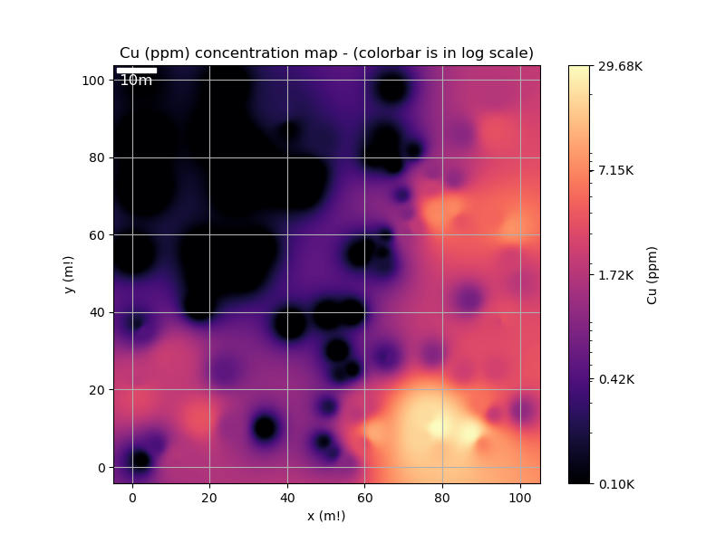
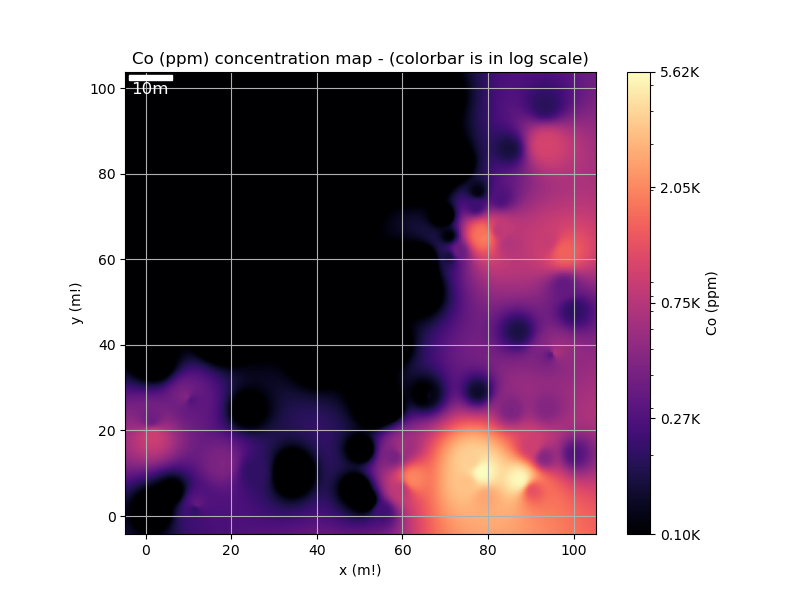
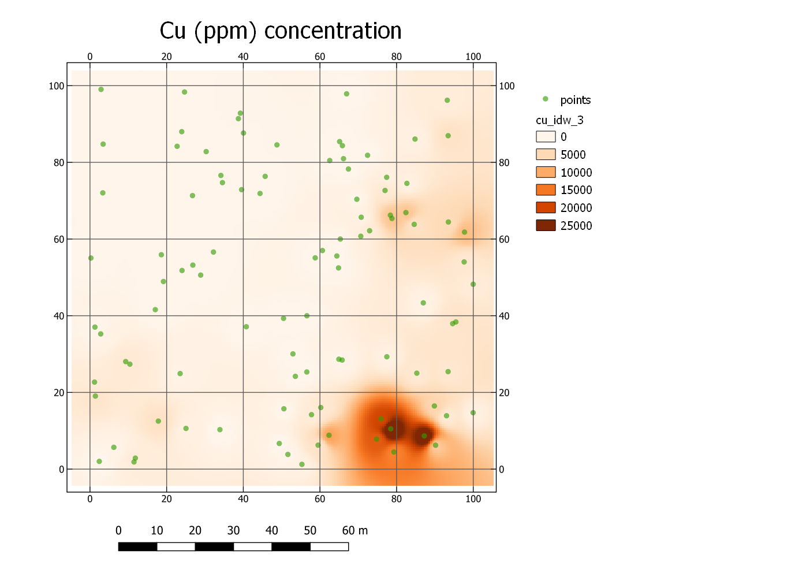
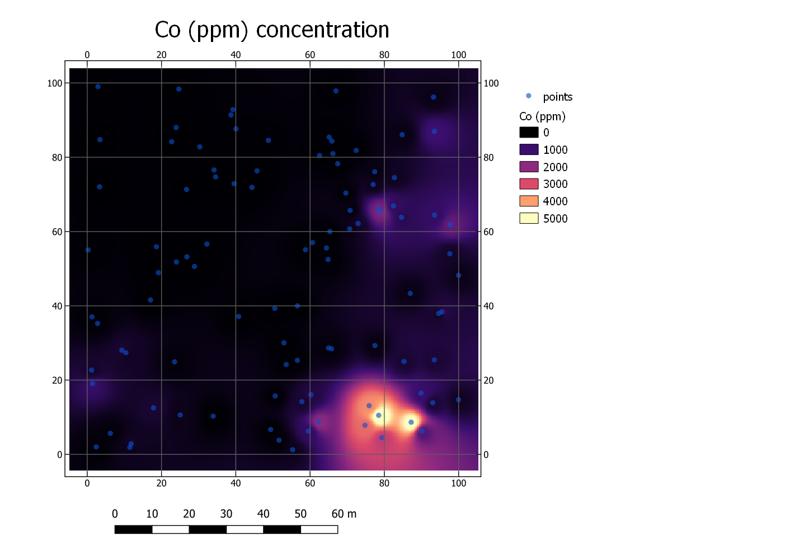

# Decription 
To generate the maps, I adopted the best practice of ensuring the geodataframe had no null values. Initially, the data included various units, with some values given in percentages (pct) and others in parts per million (ppm). To standardize the dataset, I converted all pct values to ppm using the formula: value(ppm) = value(pct) * 1e4. Addressing the issue of null values, I noticed a strong correlation between copper (Cu) and cobalt (Co) and initially used a KNN model for imputation. However, the accuracy was low, so I switched to a linear model, which produced much more satisfactory results. This approach was based on the assumption that a significant geological relationship exists between Cu and Co, analogous to the well-documented relationship between pH and calcium (Ca) in agricultural science.

Determining the appropriate cell or pixel size was critical, as it defines the resolution of the resulting maps. Ideally, this should be aligned with the density and distribution of the data points. For this project, I first calculated the point density and the average distance between points, which was 9.87 meters. The minimum distance between points was 0.88 meters, with an average of 5 meters. In geomatics, the cell size is often set to half the average distance between points or less, suggesting a cell size of approximately 5 meters. However, considering the higher cost and value of geological data collection, I decided on a smaller cell size of 0.5 meters to ensure finer resolution. Another reason for the 0.5-meter cell size was the significant difference in Co concentrations for samples 0.88 meters apart (100 ppm differences). To create a 2D map of concentration, a boundary is needed. To define the boundaries of the geodataframe, I created a rectangle around the points and added a 5-meter buffer (average distance between points) to ensure all points were included. For interpolation, I created a grid over the boundary and tested two methods: Inverse Distance Weighting (IDW) and griddata based on linear, nearest, and cubic interpolation. IDW with a distance coefficient of 3 provided the best results. In IDW, the results of the interpolated image at the point locations remain the same, with gradual changes around the points. The interpolated grid cells were converted to raster data and saved in TIF format for use in QGIS software, facilitating integration into other data science workflows.

Despite the rigorous process, several limitations and uncertainties persist. The data range was extensive, raising the possibility of outliers, but we trusted the data and did not focus on identifying or removing these outliers. The strong correlation between Co and Cu may not be true all the time. The visualization of images was based on a log scale for colormap. While this approach highlighted low and high changes, it may not be ideal for geological data. Based on the map, I found regions in the bottom right (southeast) with high concentrations of Co and Cu (more than 5k ppm for Co), and smaller concentrations in the northeast (more than 1.5k ppm for Co) and southwest (more than 800 ppm for Co).

## Final results 
### visualization maps from my code
- Cu concentration (ppm)

- Co concentration (ppm)

### visualization maps from QGIS
- Cu concentration (ppm)

- Co concentration (ppm)

